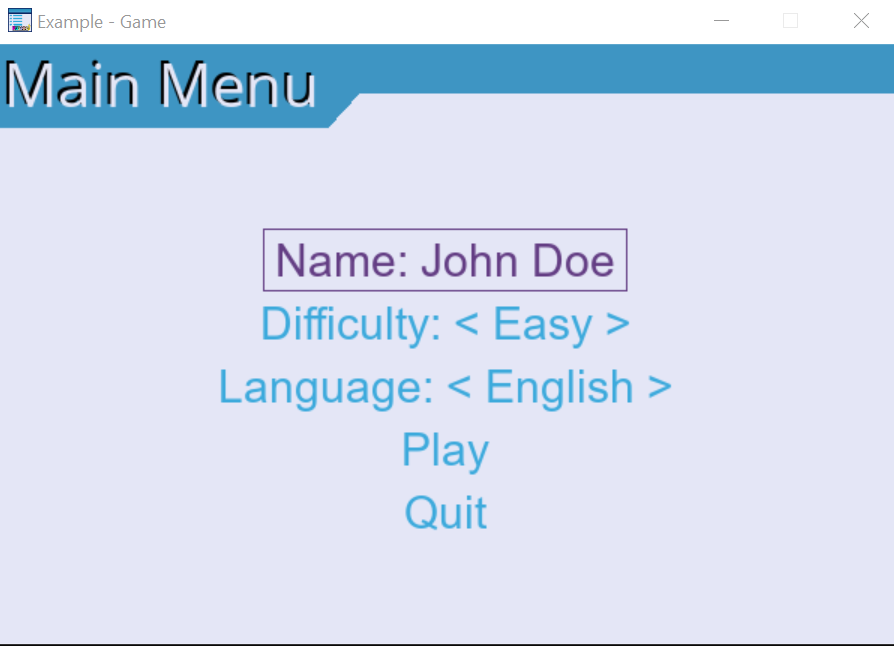
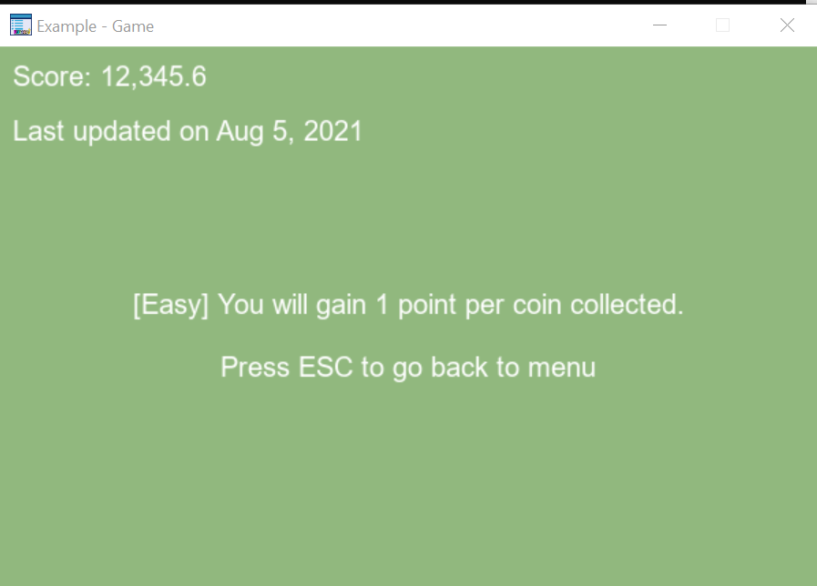
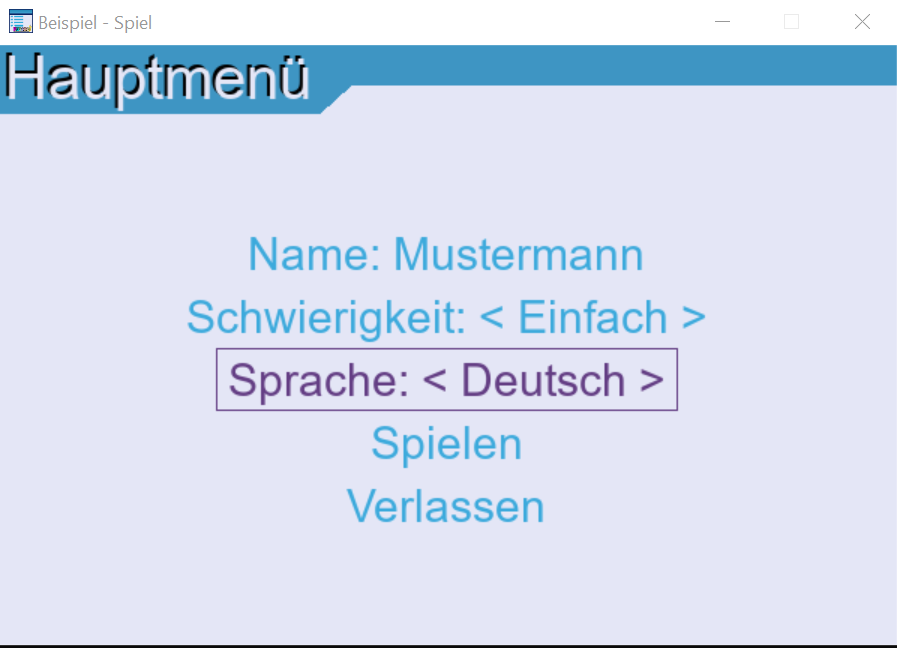
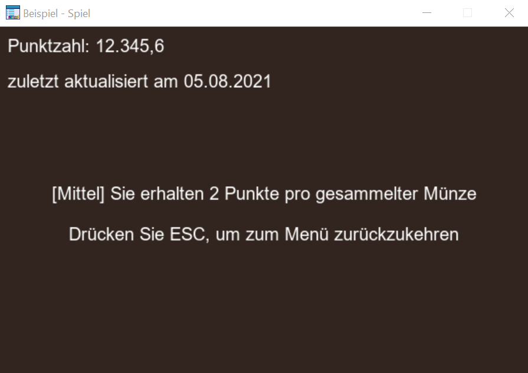
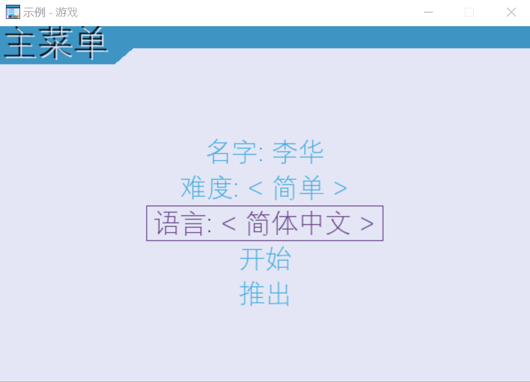
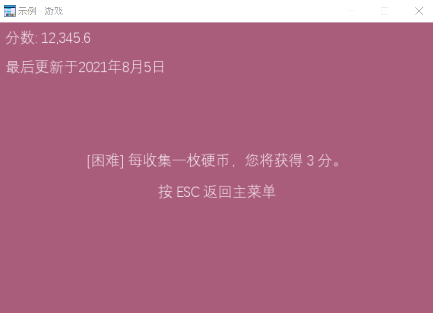

# Localizing UI and text in PyGame
Step up the localization game by utilizing pygame-menu and babel packages

## Setup
Install the following Python packages:

    pip install pygame

    pip install pygame-menu

    pip install babel

## Babel Command for Message Catalog
Babel provides the following useful commands for generating Message Catalogs for your game:
* extract: extract messages from source files and generate a POT file
* init: create new message catalogs from a POT file
* update: update existing message catalogs in a POT file
* compile: compile message catalogs to MO files

### Extract
Used for creating new translation string

    pybabel extract mygame.py -o locale/messages.pot

### Init
Initialize a new locale

    pybabel init -l en_US -i locale/messages.pot -d locale

### Update
Update all existing locale with new translation strings

    pybabel extract mygame.py -o locale/messages.pot
    pybabel update -i locale/messages.pot -d locale

### Compile
Compile into machine-readable files

    pybabel compile -d locale

## Game
Complete code for an example game

```python
import pygame
import pygame_menu
from pygame_menu.examples import create_example_window
import gettext
import glob
import os
from babel.numbers import format_decimal

from typing import Tuple, Any
from random import randrange


def update_widget_ui():
    # update window title and font
    pygame.display.set_caption(_('window_title'))
    main_menu._menubar.update_font({'name': _('widget_font')})

    # update widget title
    main_menu.set_title(_('app_title'))
    name_input.set_title(_('name') + ': ')
    difficulty_selector.set_title(_('difficulty') + ': ')
    language_selector.set_title(_('language') + ': ')
    play_button.set_title(_('play'))
    quit_button.set_title(_('quit'))

    # update widget font
    name_input.update_font({'name': _('widget_font')})
    difficulty_selector.update_font({'name': _('widget_font')})
    language_selector.update_font({'name': _('widget_font')})
    play_button.update_font({'name': _('widget_font')})
    quit_button.update_font({'name': _('widget_font')})

    # update default value and items in selector
    name_input.set_default_value(_('name_default'))
    difficulty_selector.update_items([(_('easy'), 1), (_('medium'), 2), (_('hard'), 3)])


def set_difficulty(selected: Tuple, value: Any) -> None:
    """
    Set the difficulty of the game.
    :return: None
    """
    global difficulty
    print('Set difficulty to {} ({})'.format(selected[0], value))
    difficulty = value


def set_locale(selected: Tuple, value: Any) -> None:
    """
    Set the language of the game.
    :return: None
    """
    global locale, translations
    print('Set language to {} ({})'.format(selected[0], value))
    locale = value
    translations[locale].install()
    update_widget_ui()


def random_color() -> Tuple[int, int, int]:
    """
    Return a random color.
    :return: Color tuple
    """
    return randrange(0, 255), randrange(0, 255), randrange(0, 255)


def play_game() -> None:
    # Define globals
    font = pygame.font.SysFont(_('widget_font'), 20)
    #font = pygame.font.Font('C:\WINDOWS\FONTS\SIMHEI.TTF', 30)
    global main_menu, clock, difficulty, locale, translations

    text = translations[locale].ngettext('game_message', 'game_message_plural', difficulty) % (difficulty)
    if difficulty == 1:
        f = font.render(f"[{_('easy')}] {text}", True, (255, 255, 255))
    elif difficulty == 2:
        f = font.render(f"[{_('medium')}] {text}", True, (255, 255, 255))
    elif difficulty == 3:
        f = font.render(f"[{_('hard')}] {text}", True, (255, 255, 255))
    else:
        raise ValueError('unknown difficulty {0}'.format(difficulty))
    f_esc = font.render(_('instruction_back_to_menu'), True, (255, 255, 255))
    f_score = font.render(_('score') + ': ' + format_decimal(12345.6, locale=locale), True, (255, 255, 255))

    # Draw random color and text
    bg_color = random_color()

    # Reset main menu and disable
    # You also can set another menu, like a 'pause menu', or just use the same
    # main_menu as the menu that will check all your input.
    main_menu.disable()
    main_menu.full_reset()

    frame = 0

    while True:

        # noinspection PyUnresolvedReferences
        clock.tick(60)
        frame += 1

        # Application events
        events = pygame.event.get()
        for e in events:
            if e.type == pygame.QUIT:
                exit()
            elif e.type == pygame.KEYDOWN:
                if e.key == pygame.K_ESCAPE:
                    main_menu.enable()

                    # Quit this function, then skip to loop of main-menu on line 256
                    return

        # Pass events to main_menu
        if main_menu.is_enabled():
            main_menu.update(events)

        # Continue playing
        surface.fill(bg_color)
        surface.blit(f, (int((WIDTH - f.get_width()) / 2),
                         int(HEIGHT / 2 - f.get_height())))
        surface.blit(f_esc, (int((WIDTH - f_esc.get_width()) / 2),
                             int(HEIGHT / 2 + f_esc.get_height())))
        surface.blit(f_score, (10, 10))
        pygame.display.flip()


locales = [x.split('\\')[1] for x in glob.glob('locale/*') if os.path.isdir(x)]
locale = 'en_US'
translations = {}
# print(locales)

for i in locales:
    translations[i] = gettext.translation('messages', localedir='locale', languages=[i])

translations[locale].install()

surface = create_example_window(_('window_title'), (600, 400))
DIFFICULTIES = [(_('easy'), 1), (_('medium'), 2), (_('hard'), 3)]
LANGUAGES = [('English', 'en_US'), ('Deutsch', 'de_DE'), ('简体中文', 'zh_CN')]
difficulty = 1
WIDTH = 600
HEIGHT = 400
# theme
theme = pygame_menu.themes.THEME_BLUE.copy()
theme.widget_font = _('widget_font')  # pygame_menu.font.FONT_DIGITAL
# theme.widget_alignment = pygame_menu.locals.ALIGN_RIGHT

main_menu = pygame_menu.Menu(
    height=HEIGHT,
    theme=theme,
    title=_('app_title'),
    width=WIDTH
)

name_input = main_menu.add.text_input(_('name') + ': ', default=_('name_default'), maxchar=10)
difficulty_selector = main_menu.add.selector(_('difficulty') + ': ', DIFFICULTIES, onchange=set_difficulty)
language_selector = main_menu.add.selector(_('language') + ': ', LANGUAGES, onchange=set_locale)
play_button = main_menu.add.button(_('play'), play_game)
quit_button = main_menu.add.button(_('quit'), pygame_menu.events.EXIT)

clock = pygame.time.Clock()

if __name__ == '__main__':
    main_menu.mainloop(surface)
```

Run it as follows:

    python mygame.py

### Examples

Example user interface for `en_US`





Example user interface for `de_DE`





Example user interface for `zh_CN`





